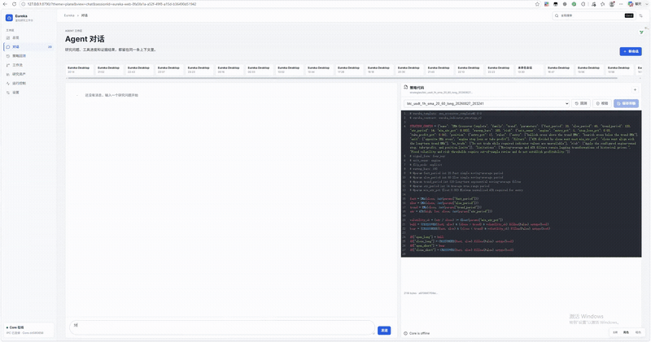
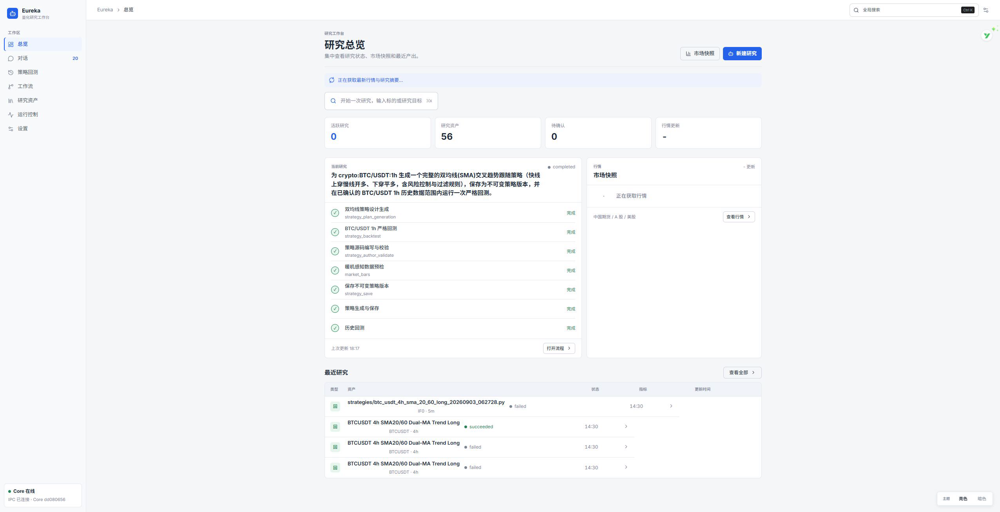
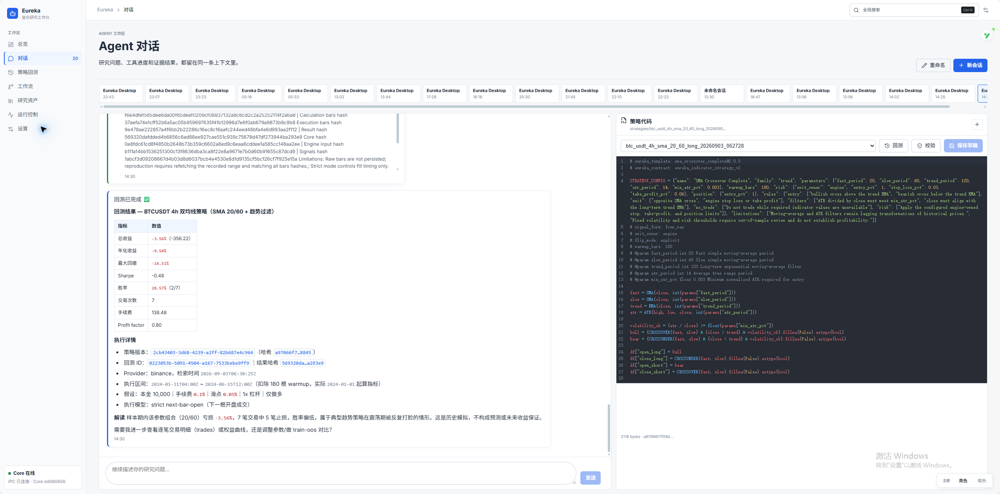
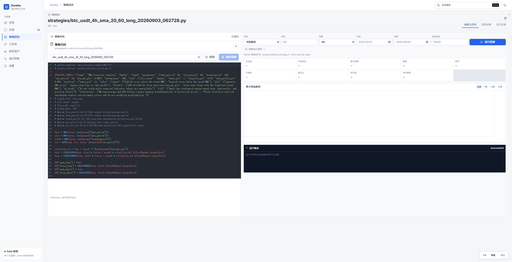
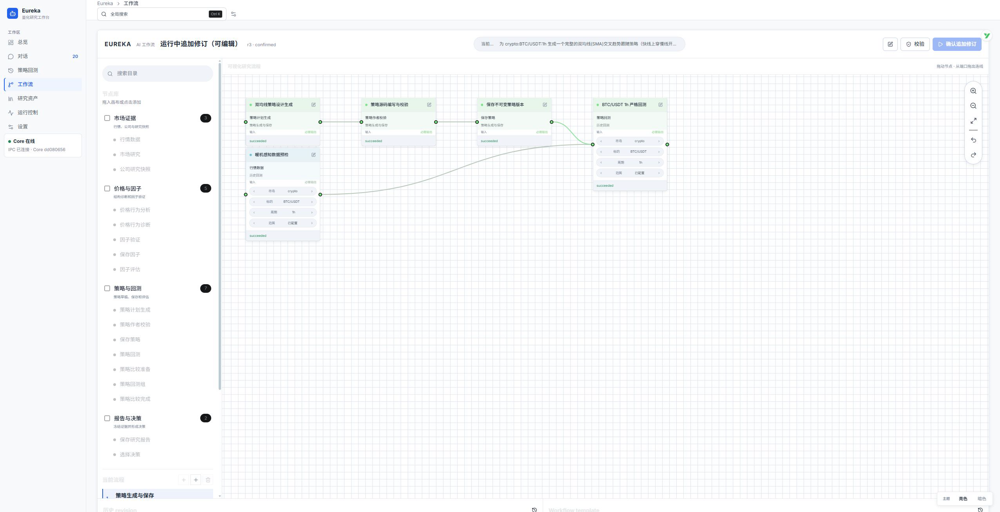
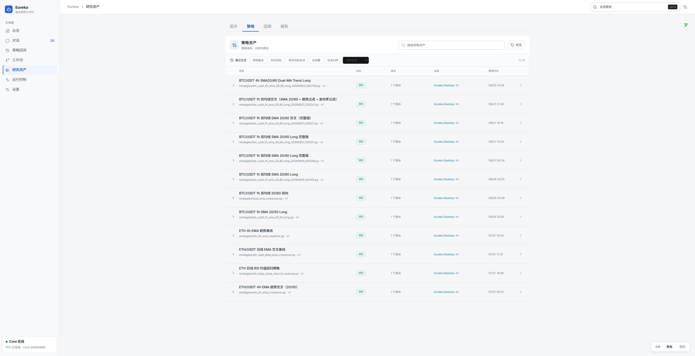
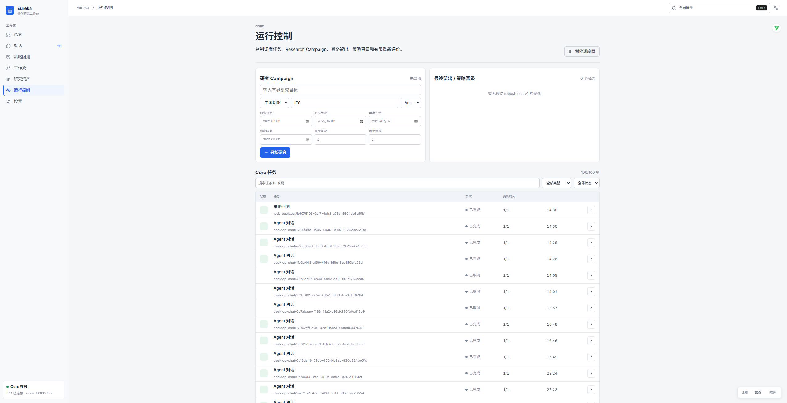
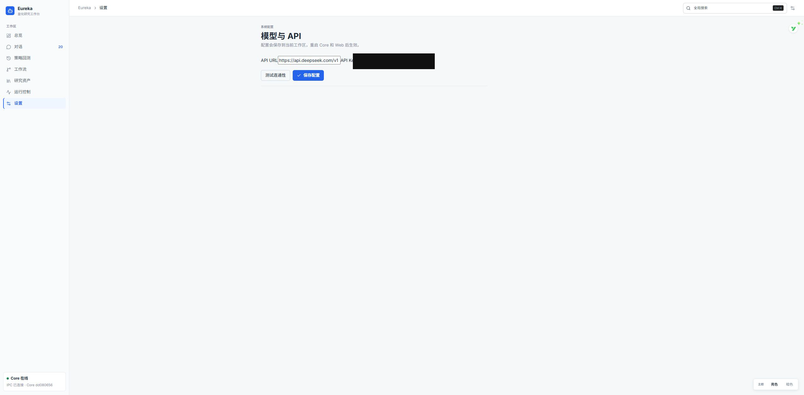

# Eureka

> 主动运行、自主研究、持续进化的量化研究智能体

Eureka 是一个本地优先的金融研究 Agent。它不是把大模型包装成一个聊天框，而是把金融知识、确定性算法、计算引擎、研究工具和可编辑工作流组织成一套可执行、可展示、可追溯的研究系统。

当前版本用于验证一条完整路径：用户用自然语言提出目标，Agent 生成研究计划并调用注册工具，工具执行确定性计算与数据处理，Core 保存过程和结果，用户可以在对话、工作流画布和资产库中继续检查与修改。

## 产品演示

[](./eureka-demo.mp4)

上方 GIF 将完整 6 分 17 秒录像压缩为约 25 秒、126 帧的无声预览，并使用 GitHub 兼容性更好的 GIF 格式循环播放。点击预览可打开原速 MP4。

- [打开或下载完整原速演示视频](./eureka-demo.mp4)
- 动态预览：约 25 秒，覆盖完整录像时间轴
- 完整视频：约 6 分 17 秒，保留原始交互过程

## Eureka 解决什么实际问题

### 1. 降低金融 Agent 的幻觉风险

通用大模型擅长理解与表达，但不应凭语言生成金融指标、价格、公式结果或回测结论。Eureka 将金融领域中需要确定性的知识、公式、规则和算法编写成注册工具，由程序硬编码执行并把结构化结果直接显示在界面中。

- 行情、历史 K 线、价格行为分析、因子验证和回测分别由明确工具负责
- 公式窗口、阈值、规则、数据范围和方法版本均由代码约束
- 数据来源、请求范围、计算范围、时间、Provider 和内容哈希随结果保留
- Agent 可以翻译、比较和解释工具结果，但不能用模型文字替换结构化权威事实
- 网页内容只作为外部证据，不获得指挥 Agent 或工具的权限

这并不意味着大模型永远不会产生错误，而是把最关键的金融事实从“模型自由生成”迁移到“确定性工具计算”，让错误更容易被发现、复查和修正。

### 2. 提供自研、可复用的金融计算与执行层

Eureka 自研了确定性的金融分析、数据约束和执行适配层，把数据预处理、闭合 K 线约束、指标暖机、价格行为公式、因子评价、策略校验和历史回测封装成稳定接口。Agent 不需要在每次研究中临时拼凑计算代码，只需提交受约束的输入并读取统一结果。历史回测核心采用经过冻结和版本约束的引擎实现，Eureka 自己负责输入合同、严格执行时序、审计、结果哈希和调用边界。

- 确定性的价格行为计算与结构化诊断证据
- 单标的、单周期的因子验证与评价
- 策略合同校验、参数冻结和不可变版本
- 严格下一根 K 线开盘执行的有界回测适配层
- benchmark、滚动区间、成本、参数邻域和时间平移等稳健性比较
- 独立 final holdout 与版本化 promotion 决策边界

相同能力可以被对话、TUI、Desktop 和本地 Web 工作台复用，不需要为每个界面重复实现一套计算逻辑。

### 3. 以“工具注册”为唯一领域能力入口

Eureka 的核心理念是：**金融领域能力统一通过注册工具暴露**。Agent 负责理解目标、选择步骤和组织研究，金融公式、数据服务、计算引擎、策略资产、回测执行与报告冻结则由各自工具负责。

```text
用户研究目标
    ↓
Agent 理解意图与编排步骤
    ↓
注册工具（唯一领域能力入口）
    ↓
金融公式 / 行情数据 / 计算引擎 / 策略与回测
    ↓
Eureka Core + SQLite 审计与谱系
    ↓
对话 / 工作流画布 / 研究资产 / 运行控制
```

这种边界让每一次能力调用都有名称、输入、状态、输出和归属。工具之间通过受控的工作流合同串联，而不是把不可检查的推理过程藏在一段模型回复里。

### 4. 自动生成且可编辑的动态工作流

复杂金融研究通常不是一次问答，而是一组存在依赖关系的任务。Eureka 可以根据研究目标生成动态 DAG 工作流草稿，并在画布中展示节点、连线、依赖和执行状态。

- Agent 根据目标生成研究计划，而不是套用固定页面流程
- 用户可在执行前增删节点、修改受限参数和调整连线
- 画布支持缩放、定位、校验和节点状态查看
- 每次修改形成追加式 revision、plan hash 和差异记录
- 执行开始后的调整通过受审计修订影响尚未开始的阶段
- 工作流节点与真实工具调用、研究产物和来源哈希关联

这使自动化研究既保留 Agent 的灵活性，也保留用户对流程结构和执行边界的控制权。

### 5. 让研究过程可以持续复查和迭代

传统聊天式 Agent 的结果容易散落在消息中，难以回答“这个结论用了什么数据、运行了哪个版本、后来改了什么”。Eureka 将会话、工具调用、工作流、策略版本、回测、比较和研究报告保存到本地 SQLite，并建立可追溯关系。

- 研究资产统一搜索、分类、标签、收藏和归档
- 策略采用不可变版本，参数修改产生明确 lineage
- 回测冻结策略快照、执行合同、来源和结果哈希
- Core 独立管理任务状态、暂停、恢复、取消和重开恢复
- 有界 Research Campaign 支持明确预算、轮次和停止条件
- 本地优先，不建立永久原始行情仓库，也不依赖远程业务后端

## 产品界面

以下截图来自同一个本地 Eureka Core 和真实 SQLite 状态。7 个主页面共享同一套工具、任务和研究资产，而不是彼此独立的演示页面。

### 研究总览

集中查看当前研究流程、市场快照、资产数量和最近研究结果。



### Agent 对话

在同一上下文中展示自然语言研究、工具执行、结构化结果和策略代码。下图使用用户指定的产品截图。



### 策略回测

策略代码、参数、市场范围、回测指标、收益曲线和运行输出位于同一个可审计工作区。



### 动态工作流画布

Agent 生成的研究计划以节点和依赖关系呈现，用户可接管编辑、校验并确认执行。



### 研究资产

集中管理因子、策略、回测和报告，保留版本、状态、来源与更新时间。



### 运行控制

统一查看 Research Campaign、最终留出、策略晋级、重新评价和 Core 任务状态。



### 模型与 API 设置

本地配置模型服务并检查连接状态。公开截图中的凭据区域已经遮挡。



## 当前能力边界

Eureka 当前是轻量金融研究产品演示，不是生产级交易平台：

- 工具计算结果可审计，但不代表策略具有预测有效性或未来收益
- 回测覆盖受约束的单标的、单周期、同步历史模拟边界
- 自动研究具有明确预算和轮次上限，不是无限自我优化系统
- 市场数据按需请求，只使用短期内存缓存，不建设永久历史行情仓库
- 不包含券商账户、交易所账户、自动下单或实盘交易能力
- 不面向远程多租户、分布式计算或生产级部署

## 设计原则

- **确定性优先**：关键金融事实由程序化工具计算，不由模型自由编造
- **工具即能力**：领域能力通过清晰、受约束、可审计的注册工具提供
- **人可接管**：自动生成的研究计划可以在画布中检查和编辑
- **结果可追溯**：来源、参数、版本、执行过程和结果保持关联
- **本地优先**：Core、SQLite 和客户端在本机形成完整闭环
- **边界明确**：研究分析、历史模拟、策略晋级和真实交易严格区分
